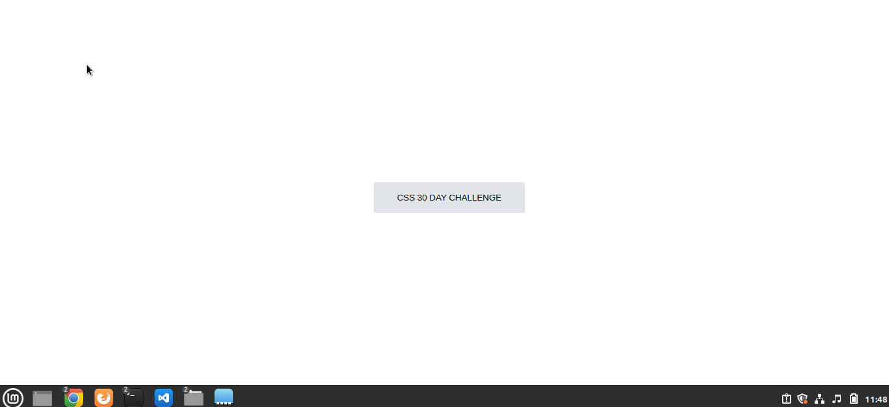

# CSS-30-DAY-CHALLENGE

30 days of CSS3, is a challenge that aims to help you improve your skills of doing doing daily mini projects using HTML5 and CSS3

  

---
* [Day 01 - Button with Hover and Focus](#id01)
--- 

- **Challenge day 1 - Button with Hover and Focus** 

[My Code (https://github.com/angelafonsecafaria/CSS-30-DAY-CHALLENGE/tree/master/day-1)

Referência:
[Create button](https://www.w3schools.com/tags/tag_button.asp)

Aprendizados:

* *pseudo-elements **:hover** and **:focus***
**
--- 
